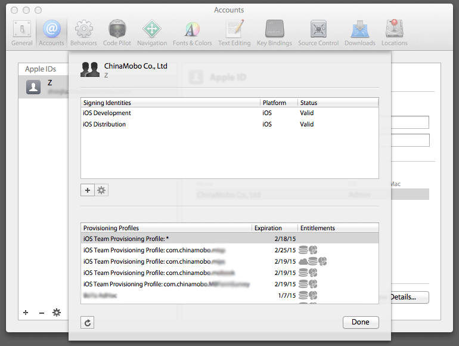
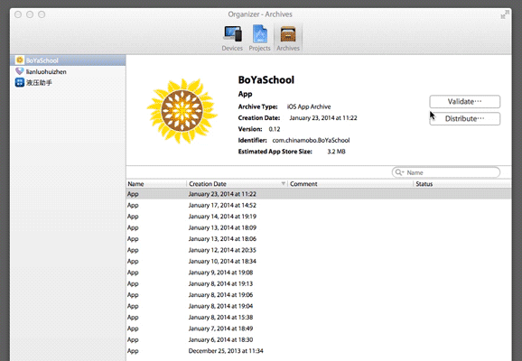

< [Back](README.md)

:warning: 本文提及方法已不再推荐，推荐使用 http://fir.im/ 服务。

内部测试版本发布教程
======================

准备
----
发布者必须是团队管理员，如果不是，现有管理员到 https://developer.apple.com/membercenter/ 赋予指定发布者管理员权限。

确认开发者中心有相应的 [App ID](https://developer.apple.com/account/ios/identifiers/bundle/bundleList.action) 和 [Distribution Provisioning Profile](https://developer.apple.com/account/ios/profile/profileList.action?type=production)，没有按提示创建。

> **Provisioning Profiles 命名规范**
> 
> 名字使用英文，中文用拼音。名称后注明类型，AdHoc 的最好再标注上日期。
> 例：
>
    MoboCeShi Dev
    MoboCeShi AdHoc 130225
    MoboCeShi AppStore


在 Xcode 首选项 > Accounts 中更新证书信息，如下所示：



打包
----
Xcode 打开相应项目，菜单 Product > Archive 进行编译打包。如果是发布新版本，打包前别忘了修改应用版本号。

默认设置下，打包成功后会弹出 Organizer 窗口，点选 Distribute 进行发布，如下动画所示：



勾选 Save for Enterprise Distribution 将生成企业发布所用的 plist 文件。

发布
----
目前团队使用 Amazon S3 存储服务做的内部应用发布，登录信息在[内网维基](http://mobos3/w/)里可以找到。内部测试的应用包放置在 mobo-app/ipas 目录下。S3 在线管理地址： [console.aws.amazon.com/s3](https://console.aws.amazon.com/s3/)

### Plist 信息

除了 IPA 包，在线安装还需要

发布新版本的话需要更新版本号，并修改更新日志。这些需要在 plist 中定义。

如果使用自动更新模块的话，更新日志需要写在 plist 中 metadata 下的 releaseNotes 中。一个完整的 plist 参考：

```xml
<?xml version="1.0" encoding="UTF-8"?>
<!DOCTYPE plist PUBLIC "-//Apple//DTD PLIST 1.0//EN" "http://www.apple.com/DTDs/PropertyList-1.0.dtd">
<plist version="1.0">
<dict>
	<key>items</key>
	<array>
		<dict>
			<key>assets</key>
			<array>
				<dict>
					<key>kind</key>
					<string>software-package</string>
					<key>url</key>
					<string>https://download_url.ipa</string>
				</dict>
			</array>
			<key>metadata</key>
			<dict>
				<key>bundle-identifier</key>
				<string>com.chinamobo.app</string>
				<key>bundle-version</key>
				<string>0.1</string>
				<key>kind</key>
				<string>software</string>
				<key>releaseNotes</key>
				<string>这里是更新日志</string>
				<key>title</key>
				<string>这里是安装时的提示信息</string>
			</dict>
		</dict>
	</array>
</dict>
</plist>
```

### 分发安装地址

在线安装地址的格式如下所示：

```
itms-services://?action=download-manifest&url=https://example.com/plist_url.plist
```

在 iOS 设备上打开这样的地址，系统首先会下载指定的 plist，提示用户是否安装。用户确认后，下载 plist 中指定的 IPA 包，然后解包，验证信息，完成安装。

FAQ
----
1. **Product > Archive 菜单项是灰的**

    答：确保 Product > Destination 选择的不是模拟器，而是 iOS Device。切换完后，Archive 菜单应该就可用了。
    
2. **在设备上安装，提示无法连接到XXX**

    答：请检查安装链接中的 plist 地址是否正确。

3. **在设备上安装，提示无法下载应用程序**

    答：观察应用安装过程卡在了哪里，如果没有下载过程——进度条没动，请检查 plist 文件中 ipa 包的地址是否正确。否则，可能是应用编译过程使用了错误的签名，不能安装在当前设备上。请尝试重新同步 Xcode 账户的 Provisioning Profiles，并重新编译打包。


参考
----
* [iOS 企业发布官方文档](http://help.apple.com/iosdeployment-apps/)
