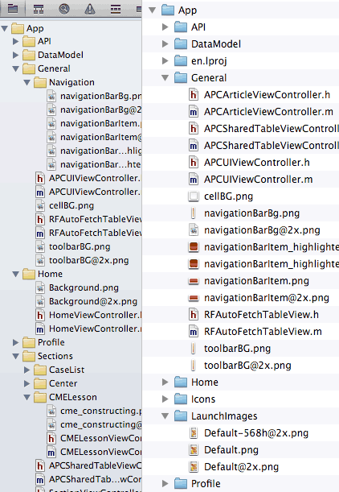
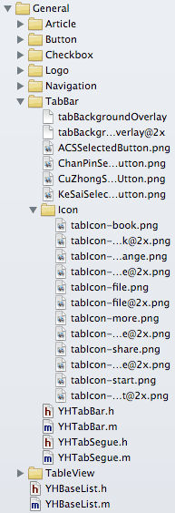
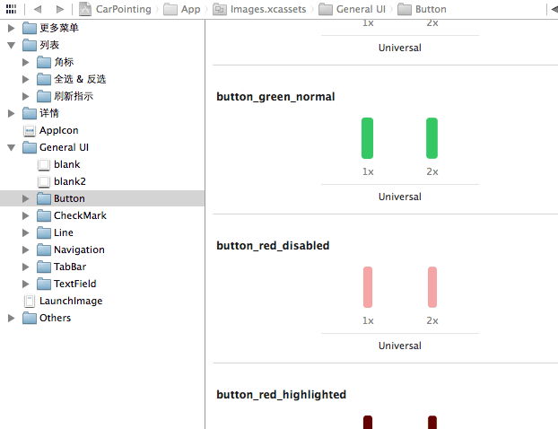
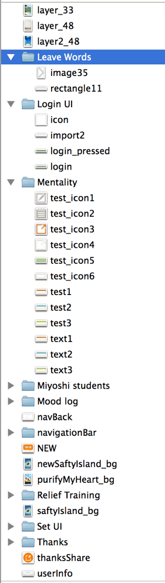
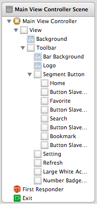
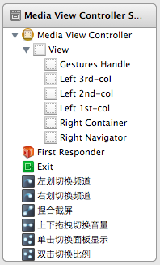
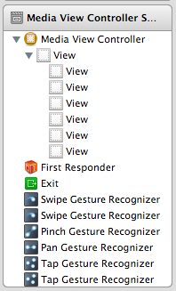

< [Back](README.md)

项目组织规范
========

欲达到的目的
----
保证可维护性是最优先原则。其两个重要方面是：易于理解，易于修改。

代码可能只写一次，但阅读的次数很容易达到几十上百次，大型项目更是如此，几万都不止。保证项目易于理解，能大大节约团队时间，提高效率，更何况理解是进行开发的前提。

易于修改不必多解释，需求变化是正常的，需求不变是不正常的。

代码文件组织
----
下图是一个示例，右侧是实际文件摆放。通用的模块放在 General 下。

随着某个 Group 中文件逐渐增多，必要时需要进一步分组以便维护。

由于 Xcode 中 Group（黄色文件夹）与实际文件目录中的结构没有强制的关联，这样会导致项目文件中的结构与文件系统中的结构不一致。调整的话需要手工移动文件，再重新加入到 Xcode 项目文件中，比较麻烦。

折中一下，规定保持 App 目录下第一层目录要一致，再下层不强制要求，能尽量尽量吧。以上图为例就是 Article、Button 等等 Group 下的文件都必须要在 General 目录下，至于 General 底下怎么组织不强制。

资源文件组织
----
对于图像，一律要使用 [Asset Catalogs](https://developer.apple.com/library/ios/recipes/xcode_help-image_catalog-1.0/Recipe.html) 进行管理。文件夹可以使用中文命名，但图像文件必须用英文，如下所示：

需要支持 iOS 6 的项目，Slicing 不起作用，需要用代码去定义图片拉伸范围。

### 图像命名

注意命名是区分大小写的（跟文件系统有关，iOS 上是区分大小写的，Mac 上分区默认设置是不区分的），推荐用小写字母加下划线的风格。

通用组件的图像应该跟只在业务页面出现的图像分开。如上面的例子，General UI 下面是各个组件的图像，每个组件又单独分成文件夹；其他是具体业务的图像，这个可以随意一些，以便于理解查找为准。

下图是一个糟糕的示例，我们从上往下过一遍。

首先是 layer_33、layer_48、layer2_48，这个命名毫无意义，人看了不知道用在哪了，怎么用的，看上去是一组相关的图，但又无法确定。这三幅图属于“放松训练”中三项训练（安全岛、清净我心、深度放松）的背景图，建议命名是：
exercise_background_safety_island、exercise_background_peaceful、exercise_background_relax。如果还有其他训练，前缀最好改成 relax_exercise。

然后是 image35，这个应该是 table view cell 的 accessory 图像，首先命名不说了，推荐 table_view_cell_accessory_disclosure_indicator，其次，应该放在 General UI/TableView 里。

login_pressed 和 login 是按钮的图像，建议命名成 login_button 或改成 button_green 放到 General UI 下，另外，状态建议用 `_highlighted`，`_disabled`，`_selected` 作为后缀。

Mentality 下面一堆 test 不用多说了吧。

下面有一个 NEW，不够具体，不知道用在哪里。搜索代码和 Storyboard 源文件得知仅在留言回复的列表中使用，应该放在留言回复的文件夹下，推荐命名 reply_indicator_new。

再往下，newSaftyIsland_bg、purifyMyHeart_bg、saftyIsland_bg，跟最上面训练背景图重复了（安全岛重复了三次），换图没有替换掉旧的。一是重复资源应用变大了，重要的是给后续维护带来困难——到底用哪个版本？重复的可不可以删除？

组织 Scene 中的视图层级
----
Storyboard 左侧的列表中可以看到视图层级关系。上面的 view 在底层，下面的 view 在 view hierarchy 顶部，可以覆盖上面的 view。在不影响可视原则的前提下，尽量按照实际布局以从上到下，从左到右的顺序组织视图的顺序。

你应当为 Storyboard 中的 view 命名做标注，如下所示：

增加标注后一目了然。如果不去命名的话，可能会像这样：

如果在 Canvas 里视图很清晰，能立即分辨各个视图那很幸运。通常你不得不挨个看一下视图是跟哪个 IBOutlet 连起来的，如果变量的命名凑巧很糟糕可能还要看看代码具体是怎么写的。更糟糕点如果视图没任何连接，连判断这个元素到底有没有用到都不那么容易。

相对以上窘境，为 view 增加标注的方法很简单，跟 Finder 中重命名文件的方式一样，选中视图然后按下回车就可以开始修改了。

