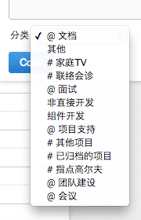

< [Back](README.md)

工时记录
====

经过投票决定，团队成员一致决定使用 TeamCola 记录工时，原有周报制度废止。请保证每天的记录。

基本原则
----

TeamCola 的时间单元是半小时，大家不必记录得很详细，工作如果比较碎的话四舍五入就好了，不必纠结。保证持续记录就好了。

关于分类
----

记录的时候别忘了指定一个分类，为了便于区分，项目类以 `#` 开头，管理性质的工作以  `@` 开头，如下所示：

### `已归档项目` 和 `其他项目`

为了减少列表长度，已经完成了的项目会被归档，你是不能添加日志到归档中的分类的，这时可以指定为 `已归档项目`。一个临时性的项目可能没有创建相应的分类，这时可以指定为 `其他项目`。

参考阅读
----

* [我们如何使用TeamCola - 彩程团队BLOG](http://blog.mycolorway.com/2011/05/29/how_we_use_teamcola_to_help_collaboration/) 
* [TeamCola背后的产品设计哲学 - 彩程团队BLOG](http://blog.mycolorway.com/2011/07/07/design-philosophies-of-teamcola/)
